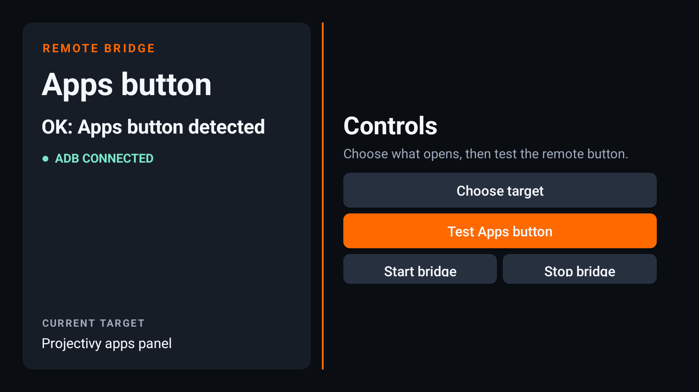

# Xiaomi TV Apps Button Bridge

This small Android TV app maps the Xiaomi remote **Apps** button to the
Projectivy Launcher apps panel. It has an ADB client in the app and starts
again after the TV starts.


The screen shows the ADB connection state. **Choose target** can map the button
to any installed Android TV app. Projectivy's apps panel is the default target.
**Test Apps button** waits for one press and shows a clear result without
opening the target.



It is made for this tested configuration:

- Xiaomi Mi TV model `MiTV-AFMU0` (`twilight`)
- Android TV 14
- Xiaomi Apps button: `/dev/input/event7`, `KEY_CHAT`
- Projectivy Launcher package: `com.spocky.projengmenu`

## Install

1. Install Projectivy Launcher and make it your default launcher.
2. Enable Developer options and ADB network debugging on the TV.
3. Connect a computer to the TV and install the APK:

   ```sh
   adb connect TV_IP:5555
   adb install XiaomiAppsButtonBridge.apk
   ```

4. Open **Xiaomi Apps Button Bridge** on the TV.
5. When the TV shows an ADB authorization message, select **Always allow** and
   then select **Allow**.

The app saves its own ADB key. It starts a foreground service after each TV
restart and waits for local ADB to become available. You do not need to keep a
computer connected.

Use the app's **Stop bridge** button if you must stop it.

## Build

Install JDK 17 and Android SDK Platform 36. Then run:

```sh
./gradlew assembleDebug
```

The APK is at `app/build/outputs/apk/debug/app-debug.apk`.

## How it works

The service connects to `127.0.0.1:5555` and runs `getevent` as the authorized
ADB shell user. When it reads a `KEY_CHAT` press, it starts the selected target.
The default Projectivy target uses the `tv.projectivy.ALL_APPS` action.

This app is hardware-specific. A different TV can use a different input device
or key code.

## License

MIT. The app uses [Kadb](https://github.com/flyfishxu/Kadb), which has the
Apache-2.0 license.
