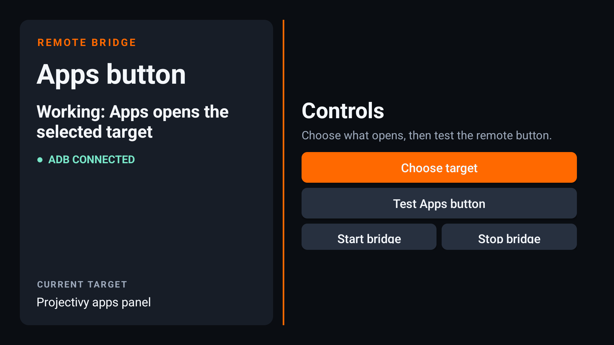
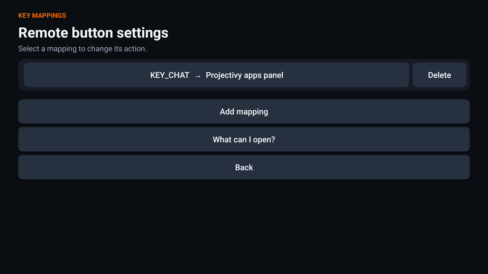

# TV Key Mapper

This Android TV app maps remote-control keys to apps and Android intents. It
has an ADB client in the app and starts again after the TV starts.



The screen shows the ADB connection state. Open **Key mappings**, capture a
remote key, and select an installed TV app or a common Android action. The
default mapping is `KEY_CHAT` (the Xiaomi Apps button) to the Projectivy apps
panel. **Test a mapped button** waits for one press and shows a result without
opening its action.

Key discovery is automatic. The app listens to all input devices and accepts
all reported `KEY_*` and `BTN_*` names. It does not contain a list for Netflix,
YouTube, or other remote brands.



Advanced users can enter a custom Android intent action, data URI, or exported
component. Android does not provide one complete list of intents. The app lists
installed TV apps and useful system settings to help users find actions. An
app's developer documentation is the best source for its deep links and custom
actions.

It is made for this tested configuration:

- Xiaomi Mi TV model `MiTV-AFMU0` (`twilight`)
- Android TV 14
- Xiaomi Apps button: `KEY_CHAT`
- Projectivy Launcher package: `com.spocky.projengmenu`

## Install

1. Install Projectivy Launcher and make it your default launcher.
2. Enable Developer options and ADB network debugging on the TV.
3. Connect a computer to the TV and install the APK:

   ```sh
   adb connect TV_IP:5555
   adb install XiaomiAppsButtonBridge.apk
   ```

4. Open **TV Key Mapper** on the TV.
5. When the TV shows an ADB authorization message, select **Always allow** and
   then select **Allow**.

The app saves its own ADB key. It starts a foreground service after each TV
restart and waits for local ADB to become available. You do not need to keep a
computer connected.

Use the app's **Stop bridge** button if you must stop it.

## Build

Install JDK 17 and Android SDK Platform 36. Then run:

```sh
make build
```

The APK is at `app/build/outputs/apk/debug/app-debug.apk`.

## Releases

This project uses [Semantic Versioning](https://semver.org/). Release tags must
use the form `vMAJOR.MINOR.PATCH`, such as `v2.1.0`. A published GitHub Release
starts a workflow that:

1. Validates the tag.
2. Runs Kotlin lint, Android lint, and unit tests.
3. Builds and verifies a signed release APK.
4. Adds the APK and its SHA-256 checksum to the GitHub Release.

Create a release with GitHub CLI:

```sh
gh release create v2.1.0 --generate-notes --title v2.1.0
```

Release signing uses the `RELEASE_KEYSTORE_BASE64`, `RELEASE_STORE_PASSWORD`,
`RELEASE_KEY_ALIAS`, and `RELEASE_KEY_PASSWORD` repository secrets. Never add
the signing key to Git.

## How it works

The service connects to `127.0.0.1:5555` and runs `getevent` as the authorized
ADB shell user. It filters the stream to key events. When it reads a configured
key, it runs the selected action. The default Projectivy target uses the
`tv.projectivy.ALL_APPS` action.

This method observes input events but does not block the original TV action.
Some mapped buttons can therefore do both the original action and the mapped
action. This also means that a branded app can cover the mapping screen during
key capture. Return to TV Key Mapper to finish the saved mapping. A different
TV can also report different key names.

## Code checks

Run all source and Android checks:

```sh
make lint
./gradlew testDebugUnitTest
```

Use `make fmt` (or `make fml`) to apply safe Kotlin formatting changes. Detekt
checks complexity and maintainability. Android Lint checks API and resource
use, and treats warnings as errors. The build workflow runs all checks before
it creates the APK.

## License

MIT. The app uses [Kadb](https://github.com/flyfishxu/Kadb), which has the
Apache-2.0 license.
